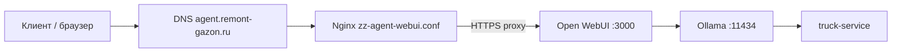

# AIServer — документация проекта

> **ИИ-агент для грузового автосервиса**  
> Стек: Ollama + Open WebUI (+ n8n опционально) на VPS Ubuntu 24.04  
> Продакшен: **https://agent.remont-gazon.ru**

Этот документ описывает архитектуру, историю развёртывания, все проблемы и их решения. Цель — чтобы новый разработчик мог продолжить работу без перебора переписки.

**Для ИИ-агентов (технический контекст):** [.docs/AGENT-CONTEXT.md](./AGENT-CONTEXT.md)  
**Виджет на сайтах:** [.docs/WIDGET-SITES.md](./WIDGET-SITES.md) (код для вставки) · [.docs/WIDGET-INTEGRATION.md](./WIDGET-INTEGRATION.md)  
**Диалоги и заявки:** [.docs/INTAKE-STORAGE.md](./INTAKE-STORAGE.md)

---

## 1. Назначение проекта

Бесплатный локальный чат-бот (без облачных API), который:

- общается с клиентом **на русском**;
- собирает заявку на ремонт/ТО грузового автомобиля;
- в конце выдаёт **одну строку** фиксированного формата:

```
ЗАЯВКА СОЗДАНА: Имя: [имя], Телефон: [телефон], Авто: [марка и модель, госномер], Услуга: [тип услуги], Время: [удобное время]
```

---

## 2. Текущее состояние (достижения)

| Компонент | Статус |
|-----------|--------|
| VPS Ubuntu 24.04 | ✅ |
| Docker + docker compose | ✅ |
| Ollama | ✅ |
| Модель `qwen2.5:1.5b` + кастомная `truck-service` | ✅ |
| Open WebUI (вход админа, регистрация закрыта) | ✅ |
| HTTPS `https://agent.remont-gazon.ru` | ✅ |
| Nginx прокси на Open WebUI | ✅ |
| `WEBUI_URL` в docker-compose | ✅ (на сервере добавлено вручную) |
| Embed-виджет (чат на сайтах) | ✅ см. [WIDGET-SITES.md](./WIDGET-SITES.md) |
| Intake API (диалоги, `/intake/admin`) | ✅ |
| Сайты с виджетом (CSP в nginx) | gortruck.ru, service-ref.ru, refmontaj.ru, ons/remont-gazon.ru |
| n8n / MAX / Telegram при заявке | ⬜ webhook готов (`INTAKE_WEBHOOK_URL`) |
| Анимация и UI виджета | ⬜ следующий этап |

### Продакшен-параметры

| Параметр | Значение |
|----------|----------|
| VPS IP | `90.156.171.36` |
| Домен | `agent.remont-gazon.ru` |
| Панель | **HestiaCP** (пользователь `rubi`) |
| Путь проекта на сервере | `/root/AIServer` |
| Open WebUI (локально) | `127.0.0.1:3000` |
| Ollama (локально) | `127.0.0.1:11434` |
| Nginx конфиг (рабочий) | `/etc/nginx/conf.d/zz-agent-webui.conf` |
| SSL сертификат | Let's Encrypt → `/etc/letsencrypt/live/agent.remont-gazon.ru/` |
| SSL в Hestia | `/home/rubi/conf/web/agent.remont-gazon.ru/ssl/` |

---

## 3. Архитектура



**Поток запроса:**

1. Клиент открывает `https://agent.remont-gazon.ru`.
2. Nginx (слушает `90.156.171.36:443`) проксирует на `http://127.0.0.1:3000`.
3. Open WebUI отправляет промпт в Ollama.
4. Модель `truck-service` использует системный промпт из `prompts/truck-service-system.txt`.

**Безопасность:**

- Ollama и Open WebUI **не** открыты наружу — только `127.0.0.1`.
- Снаружи доступен только Nginx (80/443).

---

## 4. Структура репозитория

```
AIServer/
├── .docs/
│   ├── PROJECT.md
│   ├── AGENT-CONTEXT.md
│   └── WIDGET-INTEGRATION.md
├── docker-compose.yml      # Ollama, Open WebUI, n8n (profile)
├── .env.example            # шаблон секретов
├── .env                    # секреты (НЕ коммитить!)
├── prompts/
│   └── truck-service-system.txt   # единственный источник системного промпта
├── ollama/
│   └── Modelfile.params      # temperature, template (собирается в model-create)
├── nginx/
│   ├── hestia-zz-agent-webui.conf.example  # рабочий шаблон для Hestia VPS
│   └── n8n.conf              # опционально для n8n
└── scripts/
    ├── common.sh             # общие функции
    ├── stack.sh              # start | stop | status
    ├── model-pull.sh
    ├── model-create.sh
    ├── model-update.sh
    ├── model-stop.sh
    ├── reset-webui.sh
    └── fix-line-endings.sh   # CRLF → LF после копирования с Windows
```

### Что убрали при рефакторинге

| Удалено | Причина |
|---------|---------|
| `ollama/Modelfile.truck-service` | Дублировал промпт; сборка из `prompts/` + `Modelfile.params` |
| `nginx/open-webui.conf` | Не работал на Hestia; заменён `hestia-zz-agent-webui.conf.example` |
| `scripts/stack-start.sh`, `stack-stop.sh` | Объединены в `scripts/stack.sh` |

---

## 5. Конфигурация

### 5.1 `.env`

Скопировать: `cp .env.example .env`

Ключевые переменные:

| Переменная | Назначение |
|------------|------------|
| `DOMAIN` | Домен без `https://` |
| `WEBUI_SECRET_KEY` | 64 hex-символа |
| `OLLAMA_DEFAULT_MODEL` | `truck-service` |
| `WEBUI_ENABLE_SIGNUP` | `false` — регистрация закрыта |
| `WEBUI_ADMIN_EMAIL/PASSWORD` | первый админ |
| `ENABLE_PERSISTENT_CONFIG` | `false` — .env приоритетнее при старте |

`WEBUI_URL` задаётся в **docker-compose.yml**:

```yaml
- WEBUI_URL=https://${DOMAIN}
```

### 5.2 Docker Compose

```bash
cd ~/AIServer
docker compose up -d              # Ollama + Open WebUI
docker compose --profile automation up -d   # + n8n
```

Volumes:

| Volume | Содержимое |
|--------|------------|
| `aiserver_ollama_data` | модели Ollama |
| `aiserver_open_webui_data` | пользователи, чаты, настройки WebUI |
| `aiserver_n8n_data` | n8n (если включён) |

---

## 6. Модель truck-service

### Базовая модель

На слабом VPS (2 GB RAM) используется **`qwen2.5:1.5b`**.

### Сборка

```bash
cd ~/AIServer
./scripts/fix-line-endings.sh    # после копирования с Windows
./scripts/model-pull.sh qwen2.5:1.5b
./scripts/model-create.sh qwen2.5:1.5b
```

Скрипт `model-create.sh`:

1. читает промпт из `prompts/truck-service-system.txt`;
2. добавляет параметры из `ollama/Modelfile.params`;
3. создаёт модель `truck-service` в Ollama.

### Редактирование промпта

Менять **только** `prompts/truck-service-system.txt`, затем:

```bash
./scripts/model-create.sh qwen2.5:1.5b
```

---

## 7. Nginx + HestiaCP (критически важно)

### Почему не Hestia «из коробки»

На сервере установлена **HestiaCP**. Её шаблоны:

- слушают **`90.156.171.36:443`**, а не просто `443`;
- отдают статику `public_html` («Coming Soon»);
- конфликтуют с ручными `server_name` в `/etc/nginx/conf.d/`.

**Рабочее решение:** отдельный файл `/etc/nginx/conf.d/zz-agent-webui.conf` (шаблон в репозитории: `nginx/hestia-zz-agent-webui.conf.example`).

### Установка на сервере

```bash
# Подставьте свой IP и домен
sed "s/90.156.171.36/YOUR_IP/g; s/agent.remont-gazon.ru/YOUR_DOMAIN/g" \
  ~/AIServer/nginx/hestia-zz-agent-webui.conf.example \
  > /etc/nginx/conf.d/zz-agent-webui.conf

# Отключить конфликтующие конфиги Hestia для этого домена
mv /etc/nginx/conf.d/domains/agent.remont-gazon.ru.ssl.conf /root/nginx-backup/ 2>/dev/null || true
mv /etc/nginx/conf.d/domains/agent.remont-gazon.ru.conf /root/nginx-backup/ 2>/dev/null || true

nginx -t && systemctl reload nginx
```

### SSL

Сертификат получен через **certbot** (не через Let's Encrypt в Hestia — там был 404 на ACME).

Файлы скопированы в Hestia:

```bash
cp /etc/letsencrypt/live/agent.remont-gazon.ru/fullchain.pem \
   /home/rubi/conf/web/agent.remont-gazon.ru/ssl/agent.remont-gazon.ru.pem
cp /etc/letsencrypt/live/agent.remont-gazon.ru/privkey.pem \
   /home/rubi/conf/web/agent.remont-gazon.ru/ssl/agent.remont-gazon.ru.key
```

В Hestia SSL вставляли **тремя частями**:

- Certificate → `cert.pem`
- Private Key → `privkey.pem`
- CA / Intermediate → `chain.pem`

### ⚠️ Не делать

- **Не нажимать Rebuild** домена `agent.remont-gazon.ru` в Hestia — вернёт старые конфиги.
- **Не создавать** `nginx.ssl.conf_custom` с `location /` — Hestia уже имеет свой `location /` → `duplicate location`.
- **Не оставлять** `/etc/nginx/conf.d/agent-remont-gazon.conf` параллельно с Hestia — `conflicting server name`.

---

## 8. История проблем и решений

### 8.1 Файлы не на сервере

**Симптом:** `no configuration file provided`, `.env.example: No such file`.

**Причина:** проект не был полностью скопирован на VPS.

**Решение:** `scp -r AIServer root@90.156.171.36:~/`

---

### 8.2 `bash\r: No such file or directory`

**Симптом:** скрипты не запускаются на Linux.

**Причина:** CRLF переносы строк (копирование с Windows).

**Решение:** `./scripts/fix-line-endings.sh` или `dos2unix scripts/*.sh`

---

### 8.3 `no space left on device`

**Симптом:** Ollama/Open WebUI не скачиваются, образы ~4 GB + ~1.7 GB.

**Причина:** диск 29 GB забит; неудачные pull оставляют слои в containerd.

**Решение:**

```bash
docker compose down
docker system prune -af --volumes   # жёсткая очистка (модели удалятся!)
docker pull ollama/ollama:latest
docker pull ghcr.io/open-webui/open-webui:main
```

Держать **одну** базовую модель. Регулярно: `docker system prune -f`, `df -h`.

---

### 8.4 Open WebUI `Restarting (137)`

**Симптом:** контейнер перезапускается.

**Причина:** OOM — мало RAM (~2 GB).

**Решение:** swap 4 GB, модель `qwen2.5:1.5b`, `./scripts/model-stop.sh` после сессий.

---

### 8.5 «You do not have permission» / 500 при регистрации

**Симптом:** регистрация закрыта или битая БД WebUI.

**Решение:**

- `WEBUI_ENABLE_SIGNUP=false` — входить через **«Войти»**, не «Регистрация»;
- `./scripts/reset-webui.sh` — сброс volume WebUI;
- `WEBUI_ADMIN_EMAIL/PASSWORD` в `.env`.

---

### 8.6 `ERR_CONNECTION_REFUSED` на localhost:3000

**Симптом:** браузер на Windows не открывает чат.

**Причина:** нет SSH-туннеля (Open WebUI только на `127.0.0.1`).

**Решение (до HTTPS):** `ssh -L 3001:127.0.0.1:3000 vps-aiserver`

**После HTTPS:** туннель не нужен — `https://agent.remont-gazon.ru`

---

### 8.7 Страница «Coming Soon» / «Success!» вместо чата

**Симптом:** HTTPS работает, но не Open WebUI.

**Причина:** Nginx отдаёт `public_html` Hestia; `listen 443` без IP не перехватывает трафик на `90.156.171.36:443`.

**Решение:** `zz-agent-webui.conf` с `listen 90.156.171.36:443 ssl` и `proxy_pass http://127.0.0.1:3000`.

**Проверка:**

```bash
curl -s http://127.0.0.1:3000 | head -3    # favicon.png = WebUI
curl -s https://agent.remont-gazon.ru | head -3   # должно совпадать
```

---

### 8.8 Let's Encrypt в Hestia — 404 на ACME

**Симптом:** `Invalid response from http://.../.well-known/acme-challenge/...: 404`

**Причина:** прокси на Open WebUI перехватывал challenge.

**Решение:** certbot `--webroot` с `public_html` Hestia; сертификат в Hestia вручную (cert + key + chain).

---

### 8.9 `nginx.ssl.conf_custom` — duplicate location / proxy_pass not allowed

**Причина:** Hestia подключает `*_custom` на уровне `server`, не внутри `location /`.

**Решение:** не использовать Hestia custom для прокси; использовать `zz-agent-webui.conf`.

---

### 8.10 `nginx.conf_letsencrypt` missing

**Симптом:** `open() ".../nginx.ssl.conf_letsencrypt" failed`

**Решение:** `touch /home/rubi/conf/web/agent.remont-gazon.ru/nginx.conf_letsencrypt`

---

## 9. Скрипты — справочник

| Скрипт | Назначение |
|--------|------------|
| `./scripts/stack.sh start` | Запуск стека |
| `./scripts/stack.sh stop` | Остановка |
| `./scripts/stack.sh status` | Статус контейнеров |
| `./scripts/model-pull.sh [model]` | Скачать модель |
| `./scripts/model-create.sh [base]` | Собрать truck-service |
| `./scripts/model-update.sh [base]` | Обновить base + пересобрать |
| `./scripts/model-stop.sh` | Выгрузить модель из RAM |
| `./scripts/reset-webui.sh` | Сброс БД Open WebUI |
| `./scripts/fix-line-endings.sh` | CRLF → LF |

Все команды `docker compose` — **из каталога `~/AIServer`**.

---

## 10. Шпаргалка команд

```bash
# SSH
ssh root@90.156.171.36

# Стек
cd ~/AIServer
./scripts/stack.sh start
docker compose ps
docker compose logs -f open-webui

# Модель
./scripts/model-pull.sh qwen2.5:1.5b
./scripts/model-create.sh qwen2.5:1.5b
docker exec ollama ollama list

# Nginx
nginx -t && systemctl reload nginx
curl -sI https://agent.remont-gazon.ru | head -5

# Диск
df -h
docker system df
docker system prune -f

# SSL (продление)
certbot renew --dry-run
```

---

## 11. Безопасность

- **Не коммитить** `.env` (в `.gitignore`).
- Сменить пароли, если они попадали в переписку/логи.
- `WEBUI_ENABLE_SIGNUP=false` после создания админа.
- Регулярно `apt update && apt upgrade`.

---

## 12. Следующие шаги (backlog)

1. **Виджет на сайте** — плавающий чат справа снизу → см. [.docs/WIDGET-INTEGRATION.md](./WIDGET-INTEGRATION.md) и [.docs/AGENT-CONTEXT.md](./AGENT-CONTEXT.md) §12.
2. **n8n** — парсинг строки «ЗАЯВКА СОЗДАНА» → Telegram/email.
3. **Swap 4 GB** — если ещё не добавлен постоянно.
4. **Мониторинг диска** — cron + алерт при `< 5 GB`.
5. **Бэкап** volumes `ollama_data`, `open_webui_data`.
6. **ENABLE_PERSISTENT_CONFIG=true** — после стабилизации настроек в UI.
7. **Автообновление сертификата** — cron certbot + копирование в Hestia ssl/ (если Hestia не подхватывает renew автоматически).

---

## 13. Полезные ссылки

- Open WebUI: https://github.com/open-webui/open-webui
- Ollama: https://ollama.com
- HestiaCP web templates: https://hestiacp.com/docs/server-administration/web-templates.html
- Let's Encrypt: https://letsencrypt.org

---

## 14. Контакты и доступы (заполнить локально)

> ⚠️ Не храните реальные пароли в git. Заполните у себя offline.

| Роль | Где |
|------|-----|
| VPS SSH | `root@90.156.171.36` |
| Hestia | пользователь `rubi` |
| Open WebUI админ | `.env` → `WEBUI_ADMIN_*` |
| DNS | A-запись `agent` → `90.156.171.36` |

---

*Документ обновлён после успешного запуска https://agent.remont-gazon.ru с моделью truck-service.*
